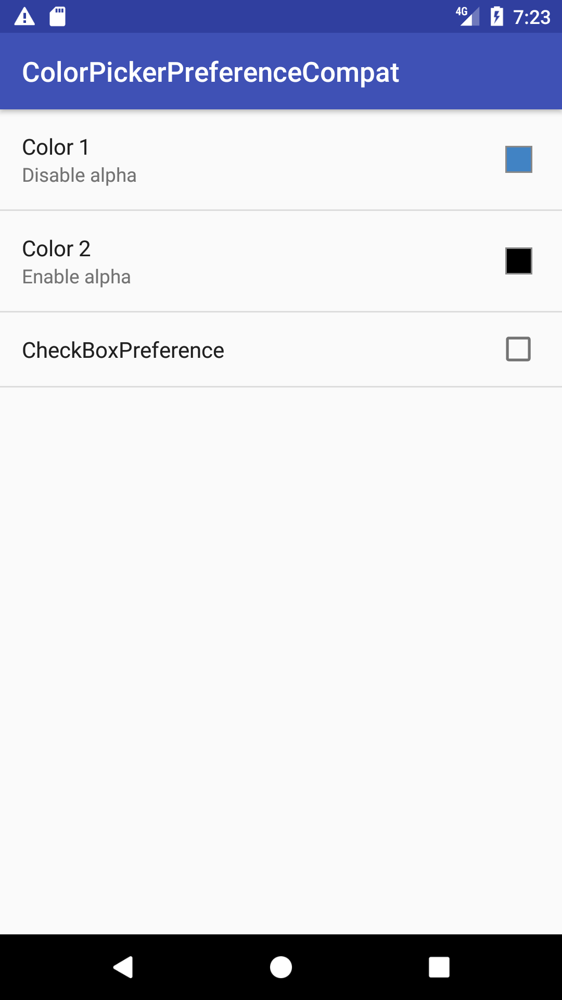
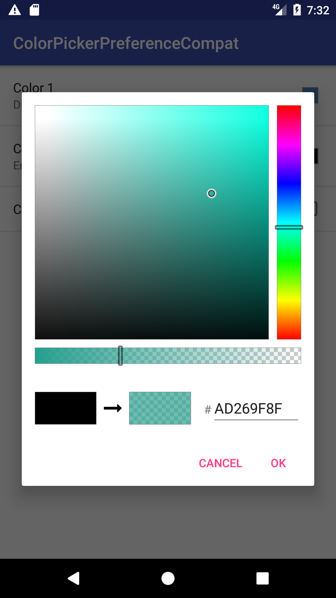

# ColorPickerPreferenceCompat
[  ](https://android-arsenal.com/details/1/5873)
[  ](https://android-arsenal.com/api?level=9)
[  ](https://bintray.com/u1aryz/maven/colorpicker-preference-compat/0.1.0/link)
[  ](https://opensource.org/licenses/Apache-2.0)

This is color picker for v7 Preference Support Library.</br>
The original ColorPickerView was written by [Daniel Nilsson](https://github.com/danielnilsson9/color-picker-view)

&nbsp;&nbsp;&nbsp;&nbsp;

## Including in project

```gradle
dependencies {
  compile 'com.u1aryz:colorpicker-preference-compat:0.1.0'
}
```

## How to use
Add the `ColorPreference` to your preference xml.

```xml
<?xml version="1.0" encoding="utf-8"?>
<android.support.v7.preference.PreferenceScreen
    xmlns:android="http://schemas.android.com/apk/res/android"
    xmlns:app="http://schemas.android.com/apk/res-auto">

  <com.u1aryz.android.colorpicker.ColorPreference
      android:defaultValue="0xFF4183C4"
      android:key="color1"
      android:persistent="false"
      android:title="Color 1"
      app:alphaSlider="true"
      />

  ...

</android.support.v7.preference.PreferenceScreen>
```

You have to extend `ColorPreferenceFragmentCompat` to your fragment.

```java
public class MyPreferenceFragment extends ColorPreferenceFragmentCompat {

    @Override public void onCreatePreferences(Bundle bundle, String s) {
        addPreferencesFromResource(R.xml.my_pref);
    }
}
```

## License

```
Copyright 2017 Daniel Nilsson
Copyright 2017 u1aryz

Licensed under the Apache License, Version 2.0 (the "License");
you may not use this file except in compliance with the License.
You may obtain a copy of the License at

   http://www.apache.org/licenses/LICENSE-2.0

Unless required by applicable law or agreed to in writing, software
distributed under the License is distributed on an "AS IS" BASIS,
WITHOUT WARRANTIES OR CONDITIONS OF ANY KIND, either express or implied.
See the License for the specific language governing permissions and
limitations under the License.
```
